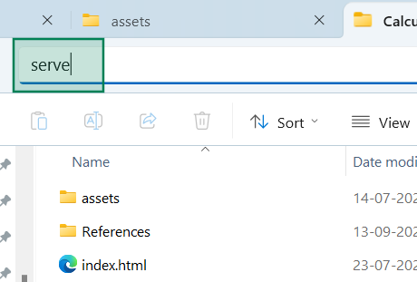
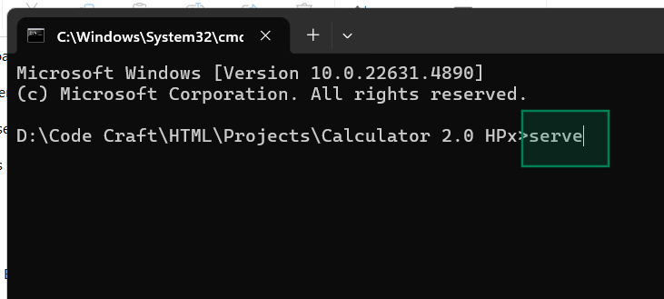
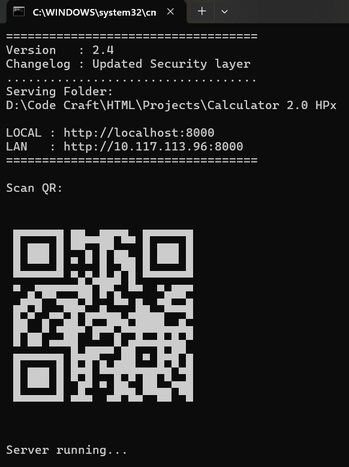

# 📁 Folder-Stream

**Stream your files. Anywhere. Instantly.**
- Folder-Stream turns any **local directory** into a **browsable website** on your network.
- Type `serve` in `❯_` **Command Prompt** or 📁 **File Explorer** to generate LAN IP.
 ```bash
📁 Local Folder ⟶ 🌐 Browsable LAN Website
```
- It generates mobile-friendly web explorer on your **LAN** with an ultra-lightweight, zero-config Python server.


- 🍀See how to setup [Open SETUP.md](docs/SETUP.md)

### 📁 Launch from Explorer
 
[View GIF Demo](https://raw.githubusercontent.com/Subham-x/folder-stream/main/assets/demo.gif)

---
### 🌸 How to Lauch
**Open Terminal in any folder** ⮕ **Type `serve`** ⮕ **Scan QR**
 


```bash
C:\Projects\demo-web-project> serve
```

### ▶️ Quick Start
Just run `serve.bat` inside the folder you want to share. That's it.

---

### ⚠️ [CRITICAL: READ THIS FIRST (Setup)](SETUP.md)
Most users fail because they forget to add the folder to their System PATH. If you want to use `serve` from any folder like a pro, **[follow the 2-minute setup here](docs/SETUP.md)**.

---

### Running Demo
 

---

### 📖 Documentation
- **[Setup & Global Access](docs/SETUP.md)** - How to use `serve` everywhere.
- **[Security & Privacy](docs/PRIVACY.md)** - Why your data is safe.
- **[Version History](docs/CHANGELOG.md)** - The journey to v2.4.

### 🛠 Features
- **Minimal UI:** Modern, responsive, and adaptive dark/light mode.
- **IP Approval:** No random device can enter without your terminal approval.
- **QR Codes:** Stop typing IPs; just scan and stream.
- **Remote Kill:** Stop the server from your phone when you're done.
